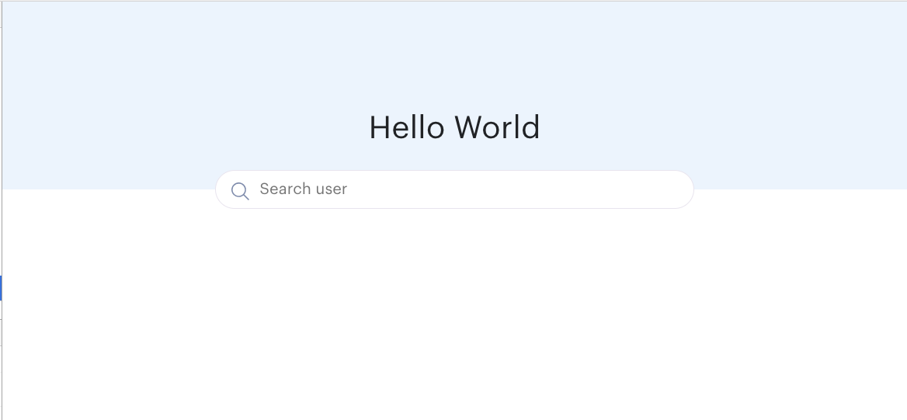
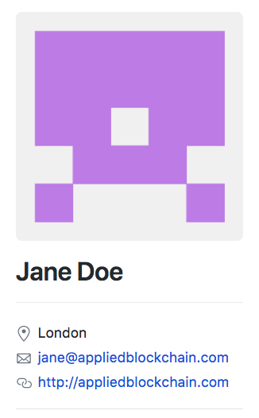

## Getting started

```
npm i
```

## Available Scripts

In the project directory, you can run:

### `npm start`

Runs the app in the development mode.<br>
Open [http://localhost:3000](http://localhost:3000) to view it in the browser.

The page will reload if you make edits.<br>
You will also see any lint errors in the console.

### `npm test`

Launches the test runner in the interactive watch mode.<br>
See the section about [running tests](https://github.com/facebookincubator/create-react-app/blob/master/packages/react-scripts/template/README.md#running-tests) for more information.

#### Code coverage

If you want to generate code coverage report use
```
npm run test -- --coverage
```

## Tasks to complete
If you use redux/reducer, please make sure to write tests.
In general writing tests is encouraged.

Feel free to delete or add any packages you want.
`redux`, `redux-logger` and `redux-saga` are already set up on the project (see `store/configureStore.js`)

### Task 1
#### containers/Profile
Create a UI with a search input similar to image 

* Input github username then when user presses enter search for that user using Github API => `GET https://api.github.com/users/:username`
* Example: `GET https://api.github.com/users/alixeb`
* Bonus point if you use `redux-saga` in your solution => Code should be added to `containers/Profile/saga/index.js`

Once you get the data from Github API, display:
* profile image => `avatar_url`
* name => `name`
* location => `location`
* email => `email` (email can be null)
* The name should link to the user profile on github: `html_url`

#### UI Example of the search result


### Task 2
You should write tests as you go, but if you have not please:
* Write test for `components/Header/Header.js`
* Write test for `containers/App/App.js`
